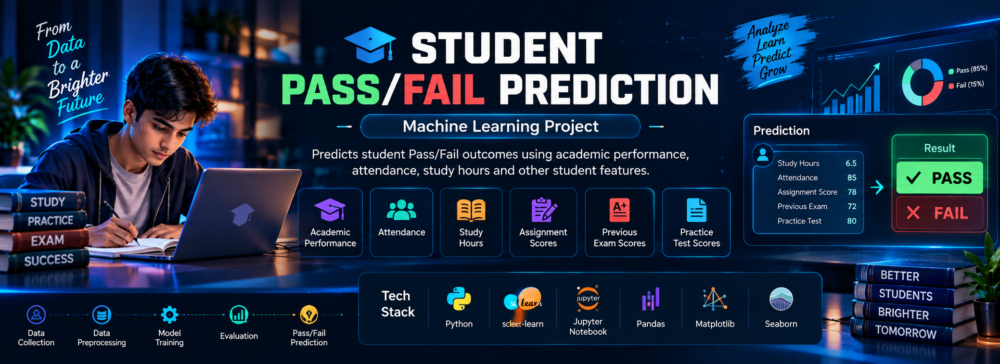

<!-- Header -->

  

  

  

  

  

  
  

  

🧑‍💻 Who I Am

const nenavathBhaskarNayak = {
  title: "Machine Learning & Python Developer",
  company: "Digix Technologies India Pvt Ltd",
  location: "Hyderabad, India",
  stack: [
    "Python",
    "FastAPI",
    "scikit-learn",
    "Pandas",
    "NumPy",
    "Seaborn",
    "HTML",
    "CSS",
    "JavaScript",
    "Git",
    "Docker"
  ],
  launchedProjects: [
    "Loan_approval_project",
    "Student_pass_fail_prediction_ML"
  ],
  certifications: [],
  status: "Open to work",
  openTo: [
    "ML Engineer",
    "Python Developer",
    "AI/ML Intern",
    "Freelance"
  ],
};

🚀 Featured Projects

🏦 Loan Approval Prediction

End-to-end loan approval prediction system using Machine Learning, Random Forest, FastAPI and a responsive web application.

  <a href="https://github.com/Nenavath-Bhaskar-Nayak/Loan_approval_project">
    

  

  </a>

Layer

Technology

Model

Random Forest (Machine Learning)

Backend / API

FastAPI

Frontend

Responsive web application

Development

Jupyter Notebook

  
  

🎓 Student Pass/Fail Prediction

Machine Learning project that predicts student Pass/Fail outcomes using academic performance, attendance, study hours and other student features.

  <a href="https://github.com/Nenavath-Bhaskar-Nayak/Student_pass_fail_prediction_ML">
    

  

  </a>

Layer

Technology

Language

Python

Approach

Machine Learning classification (Pass/Fail)

Development

Jupyter Notebook

  

🛠️ Tech Stack

Languages

Frontend

Backend / Infra

AI / ML & Data

Dev Tools

📊 GitHub Stats

## 🔥 GitHub Streak

  

  

  
---

## 📊 GitHub Stats

  
  

---

## 🔥 GitHub Streak

  

---

## 🏆 GitHub Trophies

  

---

## 📈 Contribution Activity

  

---

🤝 Connect With Me

  
  
  

<!-- Footer -->

